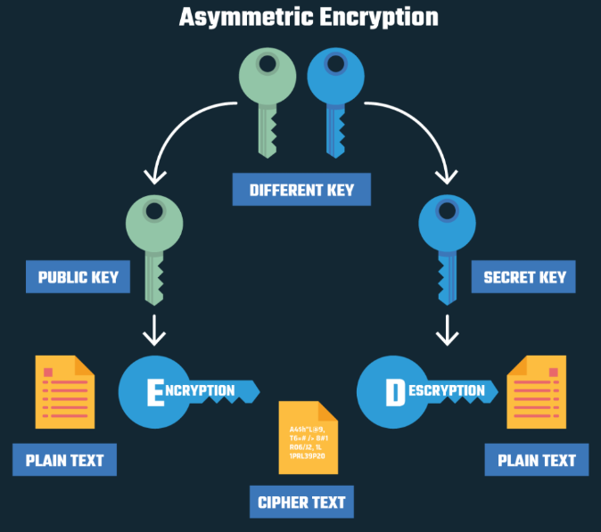
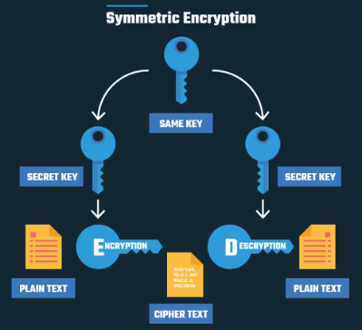

# Cryptography

## Encrypt and decrypt messages using Asymmetric or symmetric
### Asymmetric
refers to using two seperate keys when encrypt and decrypt message
- private key and public key
- public key: provided to outside world
- private key: you don't share with anyone
[https://preyproject.com/blog/types-of-encryption-symmetric-or-asymmetric-rsa-or-aes]
### Symmetric
Symmetric encryption only uses one key, all parties uses the same key to encrypt ande decrypt informarion.
[https://preyproject.com/blog/types-of-encryption-symmetric-or-asymmetric-rsa-or-aes]

## Examples on encryption algorithms
### Symmetric algorithms
- Blowfish (Drop-in replacement for DES or IDEA) – block cipher
- IDEA (International Data Encryption Algorithm) – block cipher
- AES (Advanced Encryption Standard) – block cipher
- DES (Data Encryption Standard) – stream cipher
- RC6 (Rivest Cipher 6) – block cipher
- RC5 (Rivest Cipher 5) – block cipher
- RC4 (Rivest Cipher 4) – stream cipher
https://www.bugcrowd.com/glossary/symmetric-encryption-algorithms/

### Asymmetric algorithms
- RSA (Rivest–Shamir–Adleman)
- Elliptic Curve Cryptography (ECC)
- Diffie-Hellman
- DSS (Digital Signature Standard)
  https://www.geeksforgeeks.org/asymmetric-key-cryptography/

## RSA(Rivest-Shamir-Adleman),Asymmetric, https://en.wikipedia.org/wiki/RSA_(cryptosystem)
this algoritm works in four steps
1. key generation
2. key distribution
3. encryption
4. decryption

basic principle of RSA is the observation that is practical to find 3 very 
large positive integers e, d, n, such as:

(m^e)^d = m(mod n)

however, when given only e and n, its extremly difficult to find d
- n and e comprise the public key
- d is the private key 
- the modular exponentation to e and d corresponds to encryption and decryption

In addition, because the two exponents can be swapped, the private and public 
key can also be swapped, allowing for message signing and verification using 
the same algorithm.

### Key Generation: 

1. Choose two large prime numbers p and q:
   - p and q should choosen at random to make factoring harder, should be large and have a large difference
   - standard method is to use primality test to chose random intergers until two primes is found
   - p and q are kept secret
2. Compute n = pq: 
    - n is used as modulus for both private and public keys
    - n is released as part of the public key
3. Compute λ(n) where λ is Carmichael's totient function
   - Since n = pq, λ(n) = lcm(λ(p), λ(q))
   - and since p and q are prime, λ(p) = φ(p) = p − 1, 
   - and likewise λ(q) = q − 1. Hence λ(n) = lcm(p − 1, q − 1)
   - The lcm may be calculated through the Euclidean algorithm, since lcm(a, b) =|ab|/ gcd(a, b)
   - λ(n) is kept secret.
4. Choose an integer e such that 1 < e < λ(n) and gcd(e, λ(n)) = 1; that is, e and λ(n) are coprime.
   - e having a short bit-length and small Hamming weight results in more efficient encryption 
   - e is released as part of the public key.
5. Determine d as d ≡ e−1 (mod λ(n))
   - d is the modular multiplicative inverse of e modulo λ(n). 
     - This means: solve for d the equation de ≡ 1 (mod λ(n)); d can be computed efficiently by using the extended Euclidean algorithm, since, thanks to e and λ(n) being coprime, said equation is a form of Bézout's identity, where d is one of the coefficients. 
     - d is kept secret as the private key exponent.

### Key distribution
Suppose that Bob wants to send information to Alice. If they decide to use RSA, Bob must know Alice's public key to encrypt the message, and Alice must use her private key to decrypt the message.
To enable Bob to send his encrypted messages, Alice transmits her public key (n, e) to Bob via a reliable, but not necessarily secret, route. Alice's private key (d) is never distributed.

### Encryption
After Bob obtains Alice's public key, he can send a message M to Alice.

To do it, he first turns M into an integer m, such that 0 ≤ m < n by using an agreed-upon reversible protocol known as a padding scheme. 
He then computes the ciphertext c, using Alice's public key e, corresponding to

c ≡ m^e (mod n)

This can be done reasonably quickly, even for very large numbers, using modular exponentiation. 
Bob then transmits c to Alice. Note that at least nine values of m will yield a 
ciphertext c equal to m, but this is very unlikely to occur in practice.

### Decryption
Alice can recover m from c by using her private key exponent d by computing

c^d ≡ (m^e)^d ≡ m(mod n)

Given m, she can recover the original message M by reversing the padding scheme.
